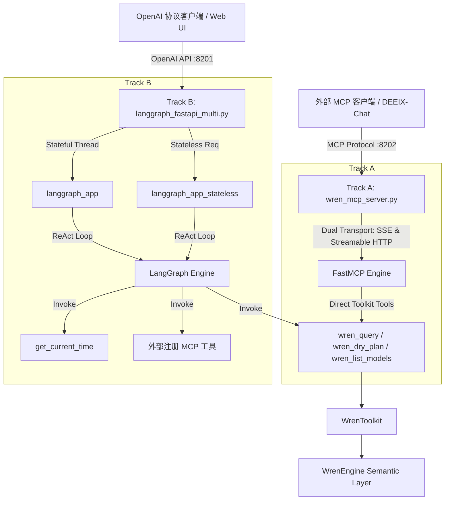

# Agent.md - Project Architectural Guidelines & Operational Boundary

> **项目路径**：`D:\dev\WrenAI\sdk\wren-langchain\examples`  
> **更新时间**：2026-07-31  

---

## 1. 项目边界与操作规范 (Project Boundaries & Rules)

### ⚠️ 严禁跨界修改 (Strict Boundary Enforcement)
- **核心边界范围**：本 Agent 所有的代码编写、配置调整、文件新建与修改操作，**仅限**在项目路径 `D:\dev\WrenAI\sdk\wren-langchain\examples` 及其子目录下进行。
- **禁区说明**：绝对**不可改动**边界外部（如 `D:\dev\WrenAI\sdk\wren-langchain\src\`、`D:\dev\WrenAI\sdk\wren-langchain\tests\` 或 `WrenAI` 其它子项目）的任何代码与文件。

---

## 2. 技术栈概览 (Technology Stack)

| 维度 | 技术/组件名称 | 版本/说明 | 作用与职责 |
|---|---|---|---|
| **语言环境** | Python | 3.10+ | 核心服务与 Agent 逻辑运行环境 |
| **API 服务框架** | FastAPI / Uvicorn / Starlette | 0.100+ | 提供高性能 RESTful、OpenAI 兼容 API、SSE 流式接口 |
| **Agent / ReAct 编排** | LangGraph & LangChain | `langgraph`, `langchain-core`, `langchain-openai` | 构建基于状态机（`StateGraph`）的多轮 ReAct Agent |
| **语义层 SDK** | `wren-langchain` | 本地核心 SDK | 提供 `WrenToolkit` 原语（工具导出、系统 Prompt 拼接、MDL 管理） |
| **底层语义引擎** | `wren-engine` | Core C++/Python 绑定 | 负责 MDL Manifest 校验、NL2SQL 解析优化、物理数据库 SQL 执行 |
| **MCP 协议支持** | FastMCP / `mcp` SDK | Dual Transport | 暴露 Model Context Protocol 接口，支持经典 SSE (`/sse`) 与 Streamable HTTP (`/mcp`) |
| **状态持久化** | MySQL / PyMySQL | `ReconnectingPyMySQLSaver` | 自动断线重连的数据库 Checkpointer，持久化多轮对话 Thread State |
| **嵌入式/向量存储** | LanceDB (可选) | `.wren/memory/` | 存储 Schema 向量嵌入与 NL/SQL 历史 Few-shot 记忆对 |
| **嵌入式测试数据库** | DuckDB | `examples/wren_project` 内内置 | 免配置开箱即用的本地查询引擎与样例数据集 |
| **前端 Web UI** | React / Vite / TailwindCSS | `wren-chat-ui` | 提供离线可用的 Web 聊天客户端界面（托管于 Track B `/` 路径） |
| **容器与部署** | Docker / Docker Compose | 多阶段镜像构建 | 支持标准构建及 `Dockerfile.cn` / `docker-compose.cn.yaml` 中国大陆加速构建 |
| **测试框架** | pytest / TestClient | `pytest>=8` | 为 `examples` 模块提供自动化接口契约与单元测试（14 项测试 100% 通过） |

---

## 3. 系统架构设计 (System Architecture)

### 3.1 总体分层与依赖关系
```
 示例编排层 (examples/ 目录)
 ├── Track A: wren_mcp_server.py (FastMCP 端口 8202)
 └── Track B: langgraph_fastapi_multi.py (FastAPI 端口 8201)
       └── 模块解耦层 (examples/server/ 子模块，支持 server.* 与 examples.server.* 双路径兼容)
             ├── logging_config.py   (结构化日志与 ContextVar 请求追踪)
             ├── checkpointer.py     (ReconnectingPyMySQLSaver 自动重连持久化)
             ├── mcp_client.py       (动态 MCP 客户端发现与重连管理)
             ├── agent_graph.py      (LangGraph ReAct 状态图与虚拟别名转发)
             └── openai_adapter.py   (OpenAI 协议转换、模型暴露与 SSE 思考流生成)
         │
         │ 依赖 WrenToolkit (from_project / get_tools / system_prompt)
         ▼
 库 SDK 层 (sdk/wren-langchain/src/wren_langchain/)
         │
         │ 驱动物理引擎与 MDL
         ▼
 底层语义引擎 (wren-engine / target DBs: MySQL, Postgres, DuckDB 等)
```

### 3.2 双轨模式 (Dual-Track Architecture)
服务架构设计为**同一张 LangGraph 状态图编译两次**，对外暴露两条独立访问通道：



- **Track A (端口 8202)**：暴露原始语义层工具供上游 LLM 自行决定 ReAct 逻辑。提供依赖预检（缺失 `mcp` 时优雅跳过）与最大重启上限保护（`MAX_MCP_RESTARTS = 5`）。
- **Track B (端口 8201)**：包含完整黑盒 Agent 逻辑，向外提供 `/v1/chat/completions` 与 `/chat/stream`，支持 SSE 增量 Thinking/Reasoning 思考流输出，并将虚拟模型别名（如 `wrenai` / `wren-agent`）自动映射至后端物理 LLM。

---

## 4. 端到端数据流程 (Data Flows)

### 流程 1: Track B OpenAI 协议请求与 ReAct 执行流
```
客户端 (POST /v1/chat/completions，包含 model: "wrenai" 或 "wren-agent")
   │
   ├──> 1. 转换请求参数为 LangChain 消息列表 (convert_openai_messages)
   ├──> 2. 获取/初始化 LangGraph 实例 (langgraph_app_stateless 或 langgraph_app)
   ├──> 3. 运行 Agent Node: 自动归集与注入 Wren 系统 Prompt (ensure_wren_system_prompt)，解析虚拟模型别名:
   │       ├──> 提示词获取源: WrenToolkit.system_prompt() (包含 wren_query/wren_dry_plan/wren_list_models 使用指南)
   │       ├──> 防错归集: 将包含 Wren 提示词及 DEEIX 文件上下文的所有 SystemMessage 统一归集至消息列表最头部 (Index 0)
   │       ├──> 若识别为虚拟别名 (wrenai / wren-agent / wren-semantic-analyst):
   │       │      └──> 自动映射至物理后端 LLM 名称 (LLM_MODEL_NAME，如 Qwen2.5-72B)
   │       ├──> 调用 ChatOpenAI bind_tools (透传 extra_body，规避 UserWarning)
   │       ├──> 若 LLM 决定调用工具 (tool_calls):
   │       │      ├──> 跳转到 ToolNode 节点
   │       │      ├──> 执行对应工具 (wren_query / wren_dry_plan 等)
   │       │      └──> 返回 ToolMessage 并回到 Agent Node (形成 ReAct 循环)
   │       └──> 若 LLM 输出最终回答 (无 tool_calls):
   │              └──> 跳转到 END 节点
   └──> 4. SSE 引擎格式化输出 (event_stream_generator):
          ├──> 实时推送 reasoning_content (思考与工具执行过程)
          ├──> 实时推送 text delta chunks
          └──> 发送 finish_reason=stop 及 [DONE] 结束符
```

### 流程 2: Track A MCP 双传输工具调用流
```
MCP Client (如 DEEIX-Chat)
   │
   ├──> 1. 发起请求至 GET /sse (Classic SSE) 或 POST /mcp (Streamable HTTP)
   ├──> 2. FastMCP 解析 JSON-RPC 指令并调用对应注册工具 (wren_query, wren_dry_plan)
   ├──> 3. WrenToolkit 校验 SQL 并调用 WrenEngine 执行 MDL 展开与物理查询
   └──> 4. 包装为标准 Envelope JSON 格式 (ok, content, data, warnings/errors) 返回
```

### 流程 3: 数据库 Profile 自动构建流 (`entrypoint.sh`)
```
环境变量 (DATASOURCE, DB_HOST, DB_USER, DB_PASSWORD, DB_NAME ...)
   │
   ├──> 1. entrypoint.sh 启动
   ├──> 2. 运行 generate_profile.py
   ├──> 3. 生成 .wren/profiles.yml 配置文件
   ├──> 4. 自动检测并写入 DB 超时与连接池参数 (DB_CONNECT_TIMEOUT, DB_MAX_CONNECTIONS)
   └──> 5. 启动 start_dual_services.py 挂载 WrenToolkit
```

---

## 5. 核心文件与模块映射 (Core File Map)

| 文件/目录 | 核心职责与功能描述 |
|---|---|
| `langgraph_fastapi_multi.py` | **Track B 主服务入口**：组合 server 子模块，提供 REST/OpenAI 端点、会话持久化与 Web UI 托管 |
| `server/` | **服务功能模块解耦目录**：包含 `logging_config.py`, `checkpointer.py`, `mcp_client.py`, `agent_graph.py`, `openai_adapter.py` |
| `tests/` | **自动化测试套件**：针对 Track A & Track B 服务的契约测试、断线重连测试与消息转换单测（`pytest examples/tests`） |
| `wren_mcp_server.py` | **Track A 核心服务**：FastMCP 双传输（SSE + Streamable HTTP）服务器，暴露 Wren 语义工具 |
| `start_dual_services.py` | **双服务启动器**：带有 `mcp` 依赖预检与最大 5 次重启上限防死循环保护的双轨启动器 |
| `langchain_demo.py` | 极简 SDK 示例 1：演示高层 `create_agent` 工厂接口 |
| `langgraph_demo.py` | 极简 SDK 示例 2：演示使用 LangGraph 原语手动构建 ReAct 图 |
| `generate_profile.py` | Profile 辅助脚本：从环境变量生成 `.wren/profiles.yml` 数据源配置 |
| `entrypoint.sh` | 容器入口脚本：自动化配置环境变量、数据源 Profile 生成与双轨服务启动 |
| `start_server.bat` | Windows 运行脚本：为 Windows 本地开发环境提供一键启动服务功能 |
| `docker-compose.yaml` / `docker-compose.cn.yaml` | 容器编排文件（默认镜像构建及中国大陆极速镜像构建版本） |
| `Dockerfile` / `Dockerfile.cn` | Docker 镜像定义文件 |
| `wren-chat-ui/` | 前端 React / Vite 聊天 UI 源码目录 |
| `wren_project/` | DuckDB 示例 Wren 项目与预置数据集目录 |
